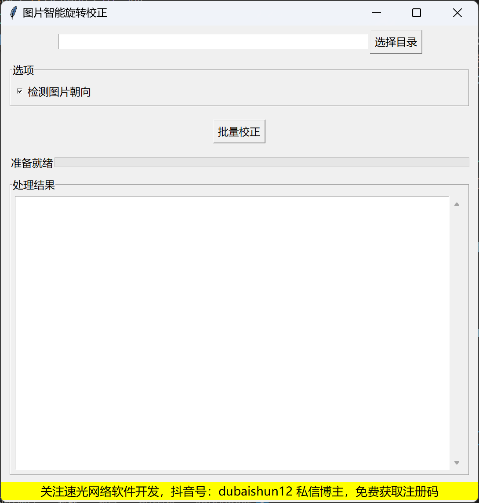

# 图片智能批量旋转校正

## 软件简介

本软件是一款基于百度OCR技术的智能图片批量旋转校正工具，能够自动检测并校正图片的方向，支持批量处理文件夹中的所有图片（包括子目录）。

## 功能特点

- 🔄 自动检测图片方向（支持向左90度、向右90度、180度三种旋转方向），暂不支持其它方向。
- 📁 批量处理文件夹中的所有图片（包括子目录）
- 🖼️ 支持多种图片格式：JPG、JPEG、PNG、BMP
- 📊 实时显示处理进度和结果
- 🎯 简洁易用的图形界面

## 安装要求

- Python 3.6+
- 操作系统：Windows / macOS / Linux

## 安装步骤

1. 克隆或下载本软件到本地
2. 安装必要的依赖库：
   ```
   pip install -r requirements.txt
   ```
   或手动安装：
   ```
   pip install pillow requests tkinterdnd2
   ```

## 使用说明

1. 运行程序：
   ```
   python 图片智能旋转校正.py
   ```

2. 点击"选择目录"按钮，选择包含需要校正图片的文件夹

3. 确保"检测图片朝向"选项已勾选

4. 点击"批量校正"按钮开始处理

5. 处理完成后，查看结果区域的处理报告

## 百度OCR配置

本软件需要使用百度OCR服务，请按以下步骤配置：

1. 访问[百度AI开放平台](https://ai.baidu.com/)
2. 注册账号并创建应用（选择文字识别服务）
3. 获取API Key和Secret Key
4. 在代码中替换以下内容：
   ```python
   API_KEY = "您的API_KEY"
   SECRET_KEY = "您的SECRET_KEY"
   ```

## 支持的旋转方向

- 向左旋转90度（逆时针90度）
- 向右旋转90度（顺时针90度）
- 旋转180度
- 暂不支持其它方向。


## 注意事项

- 本软件需要联网使用（调用百度OCR服务）
- 处理大量图片时可能需要较长时间
- 请确保网络连接稳定，以免处理中断

## 技术支持

- **速光网络软件开发**
- 官网：suguang.cc
- 联系电话/微信：15120086569
- 抖音号：dubaishun12

## 版权信息

Copyright © 2025 速光网络软件开发. All rights reserved.

---
*关注我们的抖音账号获取最新更新和技术支持！*